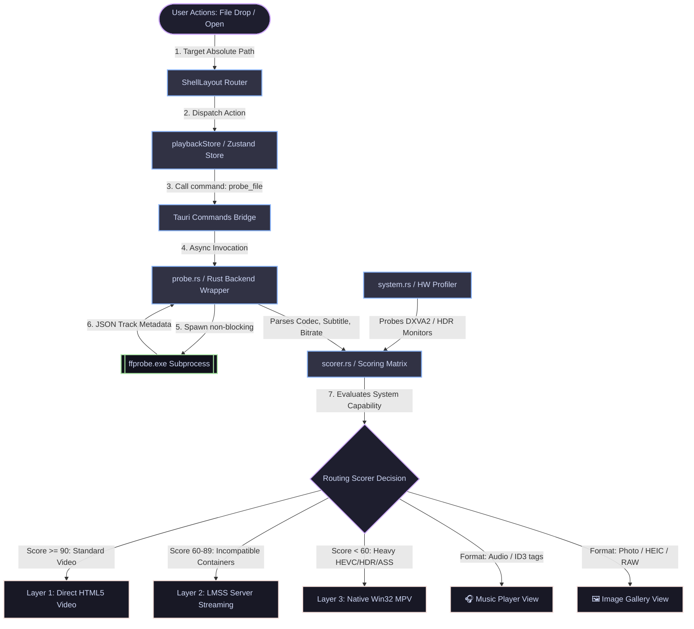

# Ruya Engine: Unified Architectural Flow Specification

This document maps the entire physical and logical flow of the Ruya Multimedia Engine. To prevent diagram scaling issues in renderers, the system architecture has been decomposed into three highly detailed, modular flow diagrams.

---

## 1. Media Ingestion & Smart Routing Lifecycle
This diagram illustrates the lifecycle of a media asset when dropped or selected, mapping the metadata inspection, system hardware capability profiling, and scoring matrix routing.

---

## 2. Playback Routing & Engine Architectures
This diagram maps the internal architecture of the three video playback layers (HTML5, local remux streaming, native Win32 `libmpv` child mapping) and the sample-precise gapless Web Audio API scheduler.

```mermaid
graph TD
  classDef view fill:#1e1e2e,stroke:#cba6f7,stroke-width:2px,color:#cdd6f4;
  classDef rust fill:#181825,stroke:#89b4fa,stroke-width:2px,color:#cdd6f4;
  classDef proc fill:#11111b,stroke:#a6e3a1,stroke-width:2px,color:#cdd6f4;

  subgraph L1_Engine ["Layer 1: HTML5 Engine"]
    V1[VideoSurface React View] -->|Render Native Element| WebVideo[HTML5 < video > Element]
    WebVideo -->|VideoTexture Pipe| ThreeJS[Three.js / WebXR 360 Sphere VR]
  end
  class V1,WebVideo,ThreeJS view;

  subgraph L2_Engine ["Layer 2: LMSS Stream Remuxer"]
    V2[WebStream Video Surface] -->|HTTP Range Requests| Axum[Axum HTTP Stream Server]
    Axum -->|Spawn Remux Pipe| FFmpeg[[ffmpeg.exe Subprocess]]
    FFmpeg -->|Fragmented MP4 Byte stream| Axum
    Axum -->|Byte chunks response| V2
    
    V2 -.->|Connection drop / Abrupt seek| CancelGuard[cancellation.rs / Stream Interruption Guard]
    CancelGuard -.->|Tokio task cancel / SIGTERM| FFmpeg
  end
  class V2 view;
  class Axum,CancelGuard rust;
  class FFmpeg proc;

  subgraph L3_Engine ["Layer 3: Native Win32 MPV Engine"]
    V3[MPV Native Island Container] -->|IPC Bounds & DPI Events| HWNDCtrl[Win32 Child HWND Controller]
    HWNDCtrl -->|SetWindowPos sizing| ChildHWND[HWND Child Window]
    ChildHWND -->|Loads Dynamic Bindings| libmpv[mpv-2.dll]
    libmpv -->|Direct HW Decoding| GPU[Direct3D11 / DXVA2 GPU Decode]
  end
  class V3 view;
  class HWNDCtrl,ChildHWND rust;
  class libmpv,GPU proc;

  subgraph Audio_Engine ["🎧 Music Player Web Audio Engine"]
    AudioContext[AudioContext Clock Scheduler] -->|Precise start schedule| ActiveNode[Active AudioBufferSourceNode]
    AudioContext -->|Pre-decodes next file 5s early| StandbyNode[Standby AudioBufferSourceNode]
    ActiveNode -.->|Sample-Accurate Gapless Transition| StandbyNode
  end
  class AudioContext,ActiveNode,StandbyNode view;
```

---

## 3. Universal Job System & NLE Editor Timeline
This diagram maps the asynchronous actor-based job queue (featuring Win32 process protection and SQLite recovery) and the timeline WebP sprite tile maps generator.

```mermaid
graph TD
  classDef ui fill:#1e1e2e,stroke:#cba6f7,stroke-width:2px,color:#cdd6f4;
  classDef actor fill:#181825,stroke:#89b4fa,stroke-width:2px,color:#cdd6f4;
  classDef external fill:#11111b,stroke:#a6e3a1,stroke-width:2px,color:#cdd6f4;

  subgraph Job_Queue ["Universal Actor-Based Job Queue"]
    UI[NLE Editor Overlay UI] -->|1. Submit Export / Process| IPC[Tauri Command Bridge]
    IPC -->|2. Send Async Message| JobActor[jobs/actor.rs / Tokio Actor Loop]
    
    JobActor -->|3. Save state & config| SQLite[jobs/serialization.rs SQLite]
    SQLite -->|4. Persist data| SQLiteDB[(ruya.db SQLite database)]
    
    JobActor -->|5. Setup Process Guard| JobGuard[jobs/process_guard.rs Win32 Job]
    JobGuard -->|6. Bind to Process Tree| WinProcessJob[Win32 Job Object tree]
    WinProcessJob -->|7. Spawn safely| FFmpegJob[[ffmpeg.exe Export Process]]
    
    JobActor -.->|8. Event notifications| EventBus[Tauri Event Bus]
    EventBus -.->|9. Visual progress bars / Toast updates| UI
  end
  class UI,EventBus ui;
  class JobActor,SQLite,JobGuard actor;
  class SQLiteDB,WinProcessJob,FFmpegJob external;

  subgraph Sprite_Timeline ["Timeline Thumbnail Tiling"]
    TimelineUI[Virtualized timeline Canvas] -->|Request slice coordinates| SpriteMap[editor/thumbnails.rs]
    SpriteMap -->|Spawn extraction| FFmpegThumb[[ffmpeg.exe Slice extractor]]
    FFmpegThumb -->|Create tiled WebP maps| TempCache[%TEMP%/ruya_cache]
    TempCache -->|Render frame grids| TimelineUI
  end
  class TimelineUI ui;
  class SpriteMap actor;
  class FFmpegThumb,TempCache external;
```

---

## Technical Mechanism Summary

### 1. Ingest & Matrix scoring
*   Instead of guessing by file extension, `ffprobe` analyzes track channels and subtitle formats (`probe.rs`). The matrix scorer (`scorer.rs`) weighs these values against probed hardware compatibility records (HDR support, GPU profiles) to dynamically route tasks, completely eliminating runtime decoding lockups.

### 2. Stream Interruption Handling (cancellation.rs)
*   When a user drags the progress scrubber (seeking) or closes the viewer, the browser's HTTP pipeline tears down active TCP range sockets. The Axum Stream Interruption Guard intercepts these drops instantly, canceling the async remux process and sending a fast termination signal to FFmpeg, maintaining 0% memory leakage on repeated scrub movements.

### 3. Non-Overlapping "Native Island" Composition
*   The child `libmpv` viewport window lives in a physical HWND structure resizing in lockstep with the surrounding React UI grid wrapper. By utilizing the Win32 `SetWindowPos` engine dynamically on layout resizing and scale adjustments, Z-index overlays are entirely bypassed.

### 4. Actor Process Isolation & Windows Job Objects
*   The Universal Job System relies on single-ownership Tokio messaging channels to completely bypass shared state deadlock risks. Every background transcode thread is assigned to an active Win32 Job Object. If the parent Ruya client is killed, Windows automatically cleans up all associated subprocesses in the tree.
