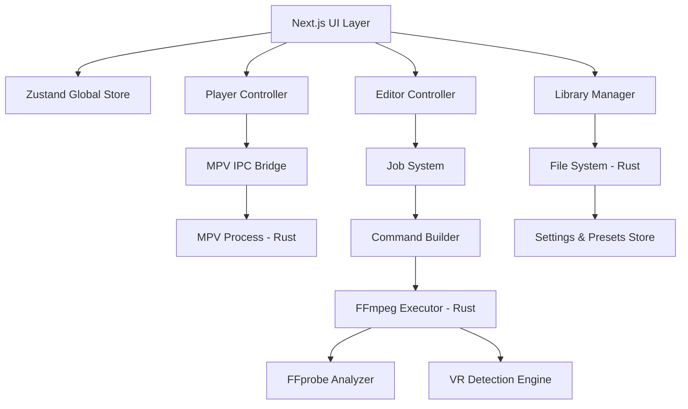
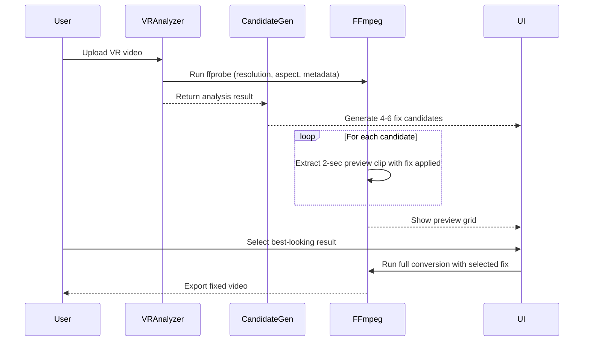

# Design Document: Mosiqi — Desktop Media Hub

## Overview

Mosiqi is a desktop media hub built for personal use. It combines seamless local media playback with optional non-destructive editing. Three distinct UI modes — video player, Spotify-like music player, and image gallery — share a single underlying engine architecture. Editing is powered by FFmpeg and is always optional: you play first, edit if needed, then export.

A standout feature is the intelligent VR video fixer: it auto-detects projection issues (fisheye, wrong equirectangular mapping, bad stereo layout), generates multiple fix candidates, renders a short preview clip for each, and lets the user visually confirm the correct fix before running the full conversion.

**Tech Stack:**

- Frontend: Next.js + TypeScript (static export mode)
- Desktop shell: Tauri v2
- Backend: Rust (Tauri commands)
- Playback: MPV (via IPC socket)
- Processing: FFmpeg + ffprobe
- State: Zustand
- Styling: Tailwind CSS + Radix UI primitives

---

## System Architecture



### Layer Responsibilities

| Layer             | Technology           | Responsibility                                        |
| ----------------- | -------------------- | ----------------------------------------------------- |
| UI                | Next.js + TypeScript | Render all three modes, handle user interactions      |
| State             | Zustand              | Global app state (current media, queue, editor state) |
| Player Controller | TypeScript class     | Abstracts MPV commands (play, pause, seek, load)      |
| Editor Controller | TypeScript class     | Manages job creation, preview, and export flow        |
| Job System        | TypeScript           | Converts user intent into structured job configs      |
| Command Builder   | TypeScript           | Translates job configs into FFmpeg argument arrays    |
| Tauri Bridge      | Rust + Tauri         | Executes MPV and FFmpeg processes, file system access |
| VR Engine         | Rust + FFprobe       | Analyzes video metadata and generates fix candidates  |

---

## Component Design

### 1. Application Shell

```
AppShell
├── Sidebar (Library navigation)
├── MainView (switches between modes)
│   ├── VideoPlayerView
│   ├── MusicPlayerView
│   └── ImageGalleryView
├── EditorPanel (overlay, opens on demand)
└── BottomBar (persistent playback controls for audio)
```

The shell detects media type on file open and routes to the correct view. The editor panel slides in as an overlay — it never replaces the player view.

### 2. Media Type Detection

```typescript
type MediaType = "video" | "audio" | "image";

function detectMediaType(filePath: string): MediaType {
  const ext = path.extname(filePath).toLowerCase();
  const VIDEO_EXTS = [".mp4", ".mkv", ".mov", ".avi", ".webm", ".ts", ".m4v"];
  const AUDIO_EXTS = [".mp3", ".flac", ".wav", ".aac", ".ogg", ".m4a", ".opus"];
  const IMAGE_EXTS = [".jpg", ".jpeg", ".png", ".webp", ".gif", ".bmp", ".tiff", ".avif"];
  // fallback: use ffprobe stream detection
}
```

### 3. Player Controller

Single controller, three UI modes. MPV handles all video and audio playback via IPC socket.

```typescript
interface PlayerController {
  load(filePath: string): Promise<void>;
  play(): void;
  pause(): void;
  seek(seconds: number): void;
  setVolume(level: number): void;
  getPosition(): Promise<number>;
  getDuration(): Promise<number>;
  setSpeed(rate: number): void;
  destroy(): void;
}
```

MPV is spawned as a child process by Rust with `--input-ipc-server` flag. The TypeScript layer sends JSON IPC commands over a named pipe/socket.

### 4. Universal Job System

Every editing operation is a Job. This is the core abstraction that keeps the system clean.

```typescript
type JobType =
  | "trim"
  | "convert_format"
  | "compress"
  | "remove_audio"
  | "add_audio"
  | "replace_audio"
  | "add_blur"
  | "sharpen"
  | "denoise"
  | "combine_videos"
  | "extract_audio"
  | "fix_vr";

interface Job {
  id: string;
  type: JobType;
  inputPath: string;
  outputPath: string;
  options: Record<string, unknown>;
  previewOnly: boolean;
}
```

Flow: `User Action → Job Config → Command Builder → Rust Executor → FFmpeg → Output`

### 5. Command Builder

Translates a Job into an FFmpeg argument array. This is the most important file in the codebase — all FFmpeg logic lives here.

```typescript
function buildCommand(job: Job): string[] {
  switch (job.type) {
    case "trim":
      return [
        "-ss",
        job.options.start,
        "-to",
        job.options.end,
        "-i",
        job.inputPath,
        "-c",
        "copy",
        job.outputPath,
      ];
    case "convert_format":
      return [
        "-i",
        job.inputPath,
        "-c:v",
        job.options.codec,
        "-crf",
        job.options.crf,
        job.outputPath,
      ];
    case "fix_vr":
      return buildVRFixCommand(job);
    // ... all other cases
  }
}
```

### 6. VR Distortion Fixer

This is the most complex feature. The pipeline:



**Analysis heuristics (ffprobe-based):**

| Signal                            | Likely Type             |
| --------------------------------- | ----------------------- |
| Aspect ratio 2:1                  | 360° equirectangular    |
| Aspect ratio 1:1                  | Fisheye                 |
| Aspect ratio 2:1 + black sides    | VR180 mislabeled as 360 |
| Metadata `spherical=true`         | Confirmed spherical     |
| Metadata `stereo_mode=top-bottom` | SBS/TB stereo           |

**Fix candidates generated:**

```typescript
const VR_FIX_CANDIDATES = [
  {
    id: "equirect_180",
    label: "VR180 Equirectangular Fix",
    filter: "v360=input=equirect:output=equirect:ih_fov=180:iv_fov=180",
  },
  {
    id: "fisheye_to_equirect",
    label: "Fisheye → Equirectangular",
    filter: "v360=fisheye:equirect",
  },
  {
    id: "stereo_sbs_fix",
    label: "Side-by-Side Stereo Fix",
    filter: "v360=input=equirect:in_stereo=sbs:out_stereo=mono",
  },
  {
    id: "stereo_tb_fix",
    label: "Top-Bottom Stereo Fix",
    filter: "v360=input=equirect:in_stereo=tb:out_stereo=mono",
  },
  {
    id: "flat_extract",
    label: "Extract Flat View (non-VR)",
    filter: "v360=input=equirect:output=flat:fov=90:yaw=0:pitch=0",
  },
  { id: "no_change", label: "No Change (original)", filter: null },
];
```

### 7. Settings & Presets Persistence

Stored locally using Tauri's app data directory. No cloud, no accounts.

```typescript
interface AppSettings {
  defaultOutputDirectory: string;
  defaultVideoCodec: "libsvtav1" | "libx264" | "libx265";
  defaultAudioCodec: "aac" | "opus" | "flac";
  defaultCRF: number;
  theme: "dark" | "light" | "system";
  lastOpenedDirectory: string;
}

interface ProcessingPreset {
  id: string;
  name: string;
  jobType: JobType;
  options: Record<string, unknown>;
}
```

---

## Data Models

### MediaFile

```typescript
interface MediaFile {
  id: string;
  path: string;
  name: string;
  type: MediaType;
  size: number;
  duration?: number; // seconds, video/audio only
  width?: number; // video/image only
  height?: number; // video/image only
  codec?: string;
  bitrate?: number;
  metadata: Record<string, string>; // from ffprobe
}
```

### PlayerState (Zustand)

```typescript
interface PlayerState {
  currentMedia: MediaFile | null;
  mediaType: MediaType | null;
  isPlaying: boolean;
  position: number;
  duration: number;
  volume: number;
  speed: number;
  queue: MediaFile[];
  queueIndex: number;
}
```

### EditorState (Zustand)

```typescript
interface EditorState {
  isOpen: boolean;
  activeJob: Job | null;
  previewPath: string | null;
  isProcessing: boolean;
  progress: number;
  savedPresets: ProcessingPreset[];
}
```

---

## UI Mode Designs

### Video Player Mode

```
┌─────────────────────────────────────────────┐
│  [Sidebar: Library]  │  Video Canvas         │
│                      │                       │
│  Recent              │   ▶ MPV renders here  │
│  Folders             │                       │
│  Playlists           ├───────────────────────┤
│                      │  ████░░░░░  00:42/3:20│
│                      │  ⏮ ⏪ ⏯ ⏩ ⏭  🔊  ⛶  │
│                      │  [Edit]  [VR Fix]      │
└─────────────────────────────────────────────┘
```

### Music Player Mode (Spotify-like)

```
┌─────────────────────────────────────────────┐
│  Playlists  │  Track List          │ Now     │
│             │                      │ Playing │
│  Library    │  01 Track Name  3:20 │         │
│  Favorites  │  02 Track Name  4:11 │ [Art]   │
│  Playlists  │  03 Track Name  2:55 │         │
│             │  04 Track Name  5:02 │ Title   │
│             │                      │ Artist  │
├─────────────────────────────────────────────┤
│  ⏮  ⏪  ⏯  ⏩  ⏭    ████░░░░  02:14/4:11  🔊│
└─────────────────────────────────────────────┘
```

### Image Gallery Mode

```
┌─────────────────────────────────────────────┐
│  [Sidebar: Folders]  │  Grid View            │
│                      │  [img][img][img][img] │
│                      │  [img][img][img][img] │
│                      │  [img][img][img][img] │
│                      ├───────────────────────┤
│                      │  ← 12 / 48 →  [Edit] │
└─────────────────────────────────────────────┘
```

### Editor Panel (overlay on any mode)

```
┌─────────────────────────────────────────────┐
│  EDITOR                              [Close] │
├─────────────────────────────────────────────┤
│  Operation: [Trim ▼]                         │
│  Start: [00:00:10]   End: [00:01:30]         │
│                                              │
│  Output format: [MKV ▼]  Codec: [AV1 ▼]     │
│  Quality (CRF): [28 ──●──────] 18-51        │
│                                              │
│  Preset: [Save as preset]  [Load preset ▼]  │
├─────────────────────────────────────────────┤
│  [Preview (2 sec)]          [Export Full]   │
└─────────────────────────────────────────────┘
```

---

## Folder Structure

```
mosiqi/
├── src/                          # Next.js frontend
│   ├── app/                      # Next.js app router pages
│   ├── components/
│   │   ├── ui/                   # Reusable primitives (Button, Slider, etc.)
│   │   ├── player/
│   │   │   ├── VideoPlayer.tsx
│   │   │   ├── MusicPlayer.tsx
│   │   │   └── ImageGallery.tsx
│   │   ├── editor/
│   │   │   ├── EditorPanel.tsx
│   │   │   ├── VRFixerPanel.tsx
│   │   │   └── PreviewGrid.tsx
│   │   ├── library/
│   │   │   └── Sidebar.tsx
│   │   └── shell/
│   │       └── AppShell.tsx
│   ├── features/
│   │   ├── player/
│   │   │   └── playerController.ts
│   │   ├── editor/
│   │   │   ├── jobSystem.ts
│   │   │   ├── commandBuilder.ts
│   │   │   └── vrFixEngine.ts
│   │   └── library/
│   │       └── mediaScanner.ts
│   ├── store/
│   │   ├── playerStore.ts
│   │   ├── editorStore.ts
│   │   └── libraryStore.ts
│   ├── hooks/
│   │   ├── usePlayer.ts
│   │   └── useEditor.ts
│   ├── types/
│   │   └── index.ts
│   └── utils/
│       ├── mediaDetector.ts
│       └── formatters.ts
├── src-tauri/                    # Rust backend
│   └── src/
│       ├── main.rs
│       └── commands/
│           ├── ffmpeg.rs         # FFmpeg execution
│           ├── mpv.rs            # MPV process management
│           ├── filesystem.rs     # File ops, directory scanning
│           └── settings.rs       # Persist settings/presets
├── public/
└── bin/
    ├── ffmpeg                    # Bundled FFmpeg binary
    └── mpv                       # Bundled MPV binary
```

---

## Key Technical Decisions

### Why Tauri over Electron

Tauri produces a ~10MB installer vs Electron's ~150MB. For a media app that already bundles FFmpeg and MPV binaries, keeping the shell lightweight matters. The Rust backend also gives direct process control for spawning and managing FFmpeg/MPV.

### Why MPV over libVLC

MPV exposes a clean JSON IPC protocol, making it straightforward to control from TypeScript. It supports hardware acceleration, VR/360 video, and frame-accurate seeking — all needed for this app.

### Why Next.js static export

Tauri's webview renders a static frontend. Next.js with `output: 'export'` gives the full React ecosystem (hooks, Radix, Tailwind) without needing a server. SSR features are simply not used.

### Why libsvtav1 over libaom-av1

`libsvtav1` is 10-20x faster than `libaom-av1` for AV1 encoding with comparable quality. For personal use on a single machine, this is the right default.

### Non-destructive editing

The original file is never modified. All exports write to a new output path. The user always chooses the output location.

---

## Engineering Rules

These rules are non-negotiable. They apply to every file written in this project.

### TypeScript

- `"strict": true` in `tsconfig.json` — always, no exceptions
- No `any` type unless absolutely unavoidable, and must be commented explaining why
- All function parameters and return types must be explicitly typed
- Use `interface` for object shapes, `type` for unions and aliases

### Code Structure

- **Max file length: 200–300 lines.** If a file grows beyond this, split it.
- **Max function length: 20–30 lines.** One function = one responsibility.
- No function should build FFmpeg commands AND update UI state. Pick one job.
- The UI layer must never construct FFmpeg argument arrays directly — that belongs in `commandBuilder.ts` only.

### Naming Conventions

| What           | Convention               | Example                                    |
| -------------- | ------------------------ | ------------------------------------------ |
| Files          | camelCase                | `commandBuilder.ts`, `playerController.ts` |
| Components     | PascalCase               | `VideoPlayer.tsx`, `EditorPanel.tsx`       |
| Interfaces     | PascalCase               | `MediaFile`, `PlayerState`                 |
| Types          | PascalCase               | `MediaType`, `JobType`                     |
| Functions      | camelCase                | `buildCommand()`, `detectMediaType()`      |
| Constants      | SCREAMING_SNAKE          | `VR_FIX_CANDIDATES`, `VIDEO_EXTS`          |
| Zustand stores | camelCase + Store suffix | `playerStore`, `editorStore`               |

Never name files `utils2.ts`, `data.ts`, `stuff.ts`, `helpers.ts` (too vague). Name files after what they specifically do.

### Separation of Concerns

The three layers must never bleed into each other:

```
UI Components       → only render and handle user events
Feature Logic       → only business rules (job creation, state transitions)
Tauri Commands      → only system calls (FFmpeg, MPV, file system)
```

Wrong:

```typescript
// Inside VideoPlayer.tsx — DON'T DO THIS
const args = ["-i", file, "-ss", start, "-to", end, output];
await invoke("run_ffmpeg", { args });
```

Right:

```typescript
// VideoPlayer.tsx calls the feature layer
const job = createTrimJob({ inputPath: file, start, end });
await editorController.runPreview(job);
```

### Linting & Formatting

- ESLint with these rules enforced:
  - `no-unused-vars: error`
  - `no-explicit-any: warn`
  - `consistent-return: error`
  - `import/order` — group imports: external → internal → relative
- Prettier for all formatting (spaces, line breaks, quotes) — no manual formatting debates
- Both must pass with zero errors before any commit

### Git Commit Style

Follow conventional commits:

```
feat: add VR fix candidate preview grid
fix: resolve MPV IPC socket timeout on Windows
refactor: split commandBuilder into per-job-type modules
chore: bundle FFmpeg binary for Windows x64
docs: update design doc with VR heuristics table
```

Format: `type: short description (under 72 chars)`
Types: `feat`, `fix`, `refactor`, `chore`, `docs`, `test`

### Every Feature Must Answer These Questions Before Being Built

1. What is the user's intent?
2. What is the Job structure?
3. What FFmpeg command does it produce?
4. Which Rust command executes it?
5. How is the result returned to the UI?

If you can't answer all five, the feature isn't ready to be coded yet.

### Common Mistakes to Avoid

- Mixing UI rendering with FFmpeg command logic
- Hardcoding FFmpeg argument strings outside `commandBuilder.ts`
- Skipping the preview step and going straight to full export
- Modifying the original input file in any operation
- Building everything at once — build one feature completely before starting the next
