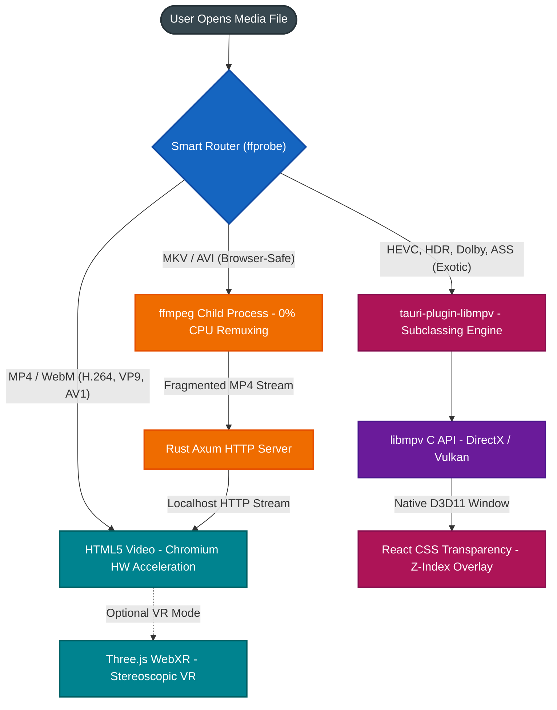
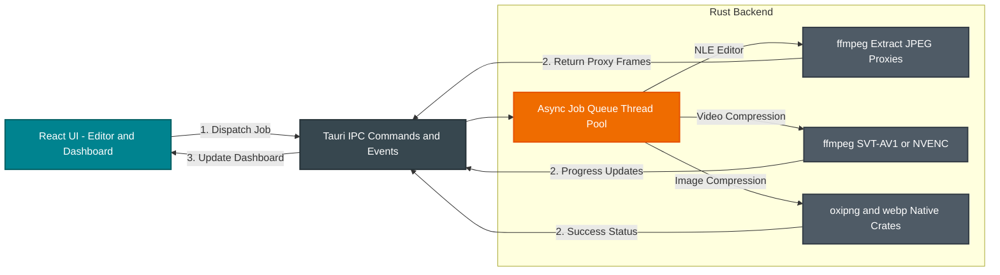

# Mosiqi Multimedia Engine Architecture

This document visually maps out the data flow and architectural structure of the Mosiqi Multimedia Engine, specifically detailing how the "Smart Router" dispatches files to the three rendering layers, and how the background editing tools function.

## 1. The Playback & VR Routing Architecture

This diagram illustrates how a media file is analyzed and routed to the most performant rendering engine based on its container and codec.

---

## 2. The Editor & Batch Processing Architecture

This diagram illustrates how heavy, asynchronous tasks (like AV1 transcoding, image compression, and video editing proxy generation) are offloaded from the React UI to the Rust backend to keep the application responsive.

